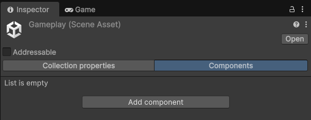
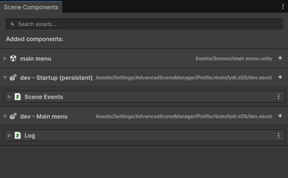
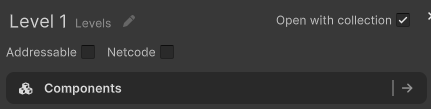

# Getting Started

Once installed, Scene Components is ready to use.

Select a supported asset, such as a Scene asset, and you will see a new **Add Component** option in the Inspector. Several built-in components may already be available, but the main purpose of Scene Components is creating your own custom components for your project.

## Create a custom Component

There are two ways to create a custom Scene Component:

1. Create one through the **Add Component** menu.



2. Create a new C# script manually.

If you create the component manually, it must inherit from `SceneComponent` and define which asset types it can be added to using the `CanAddTo` attribute.

```csharp
using SceneComponents;

[CanAddTo(scenes: true)]
public class MusicSettings : SceneComponent
{
    public AudioClip music;
    public float volume;
}
```

The `CanAddTo` attribute controls which asset types your component can be added to.

For example:

```csharp
[CanAddTo(scenes: true)]
```

allows the component to be added to Scene assets.

When created through the **Add Component** menu, the component will automatically be added to the selected asset.

## Using Components

Scene Components can be accessed in two different ways depending on how you want to find them.

### Access through an asset reference

If you already have a reference to an asset, you can directly retrieve its components.

```csharp
asset.GetComponent<T>();
```

Example:

```csharp
LoadingSettings settings = scene.GetComponent<LoadingSettings>();
```

This is the recommended approach when you already know which asset you want to access.

### Find components without an asset reference

Sometimes you need to find assets based on the components they contain. For example, an editor tool might need to find all Scenes that contain a specific component.

In these cases, you can use the `SceneComponentManager`.

```csharp
SceneComponentManager.GetAllComponentOfType<T>();
```

This returns all components of a specific type that are available to the system.

For more available methods and advanced usage, see the [API](./API/) documentation.

## Overview Window

The **Overview** window provides a central place to manage all Scene Components in your project.

Open it from:

**Window > Scene Components**

From here you can:

- View every asset that contains Scene Components.
- Search for assets by component type.
- Quickly add or remove components.
- Inspect the components attached to each asset.

This is particularly useful for large projects where manually locating components across many assets becomes difficult.



## Advanced Scene Manager Integration

If you're using [Advanced Scene Manager](https://lazy.solutions/advanced-scene-manager), Scene Components integrates directly with it.

In addition to Scene assets, you can also attach components to **Scene Collections** and access them using the familiar API.

```csharp
scene.GetComponent<T>();
sceneCollection.GetComponent<T>();
```

Advanced Scene Manager also adds a convenient **Components** menu to every Scene and Scene Collection, making it quick to add, remove, and inspect components without leaving the Scene Manager window.

